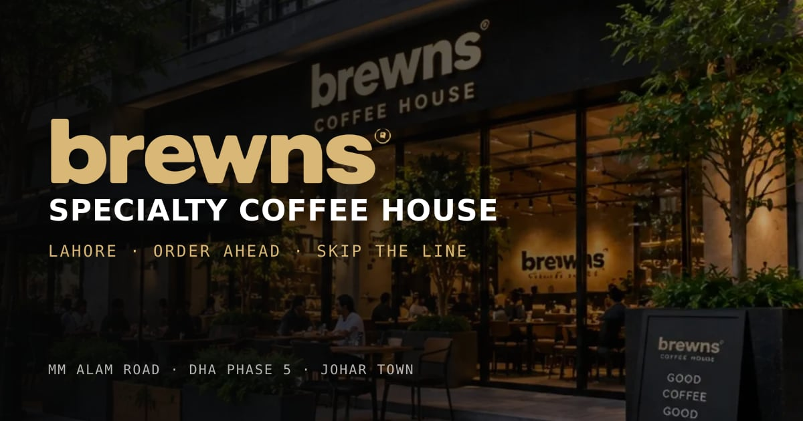

<div align="center">

# brewns

**A specialty coffee house in Lahore, and the website that runs it.**<br>
Menu, shop, order-ahead with live tracking, and three shops: MM Alam Road, DHA Phase 5 and Johar Town.

[](https://github.com/baigcoder/brewns/actions/workflows/ci.yml)
[](https://vercel.com/new/clone?repository-url=https%3A%2F%2Fgithub.com%2Fbaigcoder%2Fbrewns&env=NEXT_PUBLIC_ORDER_ENDPOINT,NEXT_PUBLIC_CAFE_EMAIL,NEXT_PUBLIC_SITE_URL&envDescription=Order%20emails%2C%20the%20caf%C3%A9%20inbox%20and%20the%20site%20address&envLink=https%3A%2F%2Fgithub.com%2Fbaigcoder%2Fbrewns%23environment-variables)



Next.js 16 · React 19 · three.js · Web Audio · Lenis · Bun · Vercel

</div>

---

## Contents

- [What's inside](#whats-inside)
- [Quick start](#quick-start)
- [Scripts](#scripts)
- [Environment variables](#environment-variables)
- [Deploying to Vercel](#deploying-to-vercel)
- [Editing content](#editing-content)
- [Images, photos and 3D](#images-photos-and-3d)
- [How it works](#how-it-works)
- [Project layout](#project-layout)
- [Before going live](#before-going-live)
- [Troubleshooting](#troubleshooting)

## What's inside

| | |
|---|---|
| **Hero** | A 3D coffee bag and cup in the dark edition packaging: matte black stock, gold wordmark, cream type. |
| **Menu** | Coffee, specialty drinks, bakery and a full kitchen (burgers, pasta, rolls, pizza, coolers) with filters and a full café menu. |
| **Shop** | 29 products with interactive 3D product pages, options and prices in rupees; a two-column grid on phones. |
| **Order ahead** | Pickup or delivery from the nearest shop: delivery areas and fees, payment choice (cash, card, JazzCash / Easypaisa), Punjab sales tax (16% cash, 5% card), and a thermal-printer receipt that tears off. |
| **After ordering** | A full bill, order emails to the café and the customer, live stages at real times, a message thread with the café and rider, WhatsApp / call / directions, and a live 3D map of the rider's scooter crossing the city. |
| **Reviews** | Twelve reviews in a carousel with filters by drink, food and shop, *helpful* marks, *verified order* stamps, and a form to leave your own. |
| **Inside brewns** | A photo mosaic of the shops with a full-screen viewer. |
| **The founder** and **brand ambassador** | Hassan Baig, who built brewns and this site; Hania Aamir, brewns' ambassador. |
| **Sound** | A café that plays in the browser: room murmur, the espresso bar, a lo-fi bed and touch sounds, with a mixer. Off until you turn it on. |
| **Everyone** | Works with reduced motion, without WebGL, by keyboard and on any screen size. |
| **Found and shared** | Structured data for all three shops, a share image, a sitemap and robots rules. |

## Quick start

You need [Bun](https://bun.sh) 1.3 or newer and [Node.js](https://nodejs.org) 20.9 or newer.

```bash
git clone https://github.com/baigcoder/brewns.git
cd brewns
bun install
bun run dev            # http://localhost:3000
```

**Updating to the latest code:**

```bash
git stash              # set aside any local edits so the pull can't be blocked
git pull
bun install            # only needed when package.json changed
bun run fresh          # stops the old server, clears the cache, starts on the new code
```

Use `bun run fresh` instead of `bun run dev` after every pull. See [Troubleshooting](#troubleshooting) for why.

## Scripts

| Command | What it does |
|---|---|
| `bun run dev` | Dev server with Turbopack on http://localhost:3000. |
| `bun run fresh` | Stops any dev server still running, clears `.next`, prints the commit, then starts the dev server. |
| `bun run build` | Production build. Type-checks and prerenders every route as static. |
| `bun run start` | Serves the production build. |
| `bun run lint` | ESLint 9 with `eslint-config-next/core-web-vitals`. |
| `bun run typecheck` | `tsc --noEmit` with TypeScript 7. |
| `bun run kitchen:white` | Puts new kitchen photos on a white studio background ([details](#kitchen-photos)). |
| `bun run snapshots` | Re-renders the bag and cup pictures from the 3D models ([details](#bag-and-cup-pictures)). |
| `bun run build:models` | Regenerates the shop's glTF models ([details](#3d-models)). |

## Environment variables

Copy `.env.example` to `.env.local` for local use; on Vercel, add them under **Settings → Environment Variables**. All are optional.

| Variable | What it's for | Default |
|---|---|---|
| `NEXT_PUBLIC_ORDER_ENDPOINT` | A form-to-email endpoint that receives every order, for example a [Formspree](https://formspree.io) form pointed at the café's inbox. Each order arrives as a table (order, type, customer, mobile, address or shop, time, items, total, payment, note) with the customer's email as reply-to. | none: the confirmation offers "email me this receipt" and "email the café" links instead |
| `NEXT_PUBLIC_CAFE_EMAIL` | Shown on the "email the café" links. | `orders@brewns.coffee` |
| `NEXT_PUBLIC_SITE_URL` | The site's public address, for canonical links, the sitemap and share previews. | `https://brewns.coffee` |

`NEXT_PUBLIC_` values are built into the page, so redeploy after changing them.

## Deploying to Vercel

The repository is ready for Vercel. `vercel.json` sets the build and the headers.

**From GitHub (recommended):**

1. Push to GitHub, then open [vercel.com/new](https://vercel.com/new) and import `baigcoder/brewns`, or click **Deploy with Vercel** above.
2. Vercel detects Next.js and Bun on its own. Leave the build settings as they are.
3. Add the [environment variables](#environment-variables) you need.
4. Deploy. Every push to the production branch (`main` by default) goes live, and every other branch and pull request gets its own preview URL.
5. Under **Settings → Domains**, add your domain, then set `NEXT_PUBLIC_SITE_URL` to it and redeploy.

**From the command line:**

```bash
bunx vercel            # first run links the project, then deploys a preview
bunx vercel --prod     # deploy to production
```

**What `vercel.json` does:**

- Installs with `bun install --frozen-lockfile`, so Vercel builds exactly the versions in `bun.lock`.
- Runs any server code in Mumbai (`bom1`), the closest region to Lahore. The site itself is static and served from Vercel's global CDN.
- Adds security headers (`nosniff`, `SAMEORIGIN` framing, a strict referrer policy, and no camera, microphone, location or payment access).
- Caches images and models for a day and revalidates in the background, so replaced photos show up; caches the Draco decoder for a year.

`.vercelignore` keeps the photo originals, tools and QA scripts out of CLI uploads. Every push is also checked by [GitHub Actions](.github/workflows/ci.yml) (lint, typecheck and build), so a broken commit shows a red cross before it reaches Vercel.

## Editing content

Almost everything is data near the top of its feature in `components/brewns/initBrewns.ts`:

| Constant | Drives |
|---|---|
| `PRODUCTS` | The shop grid and product pages: prices, options, 3D model. |
| `KITCHEN` | Burgers, pasta, rolls, pizza and coolers, for the menu, shop, full menu and product pages. |
| `ALL_MENU_CARDS` | The menu section's cards. |
| `FULL_MENU_SECTIONS` | The full café menu dialog. |
| `REVIEWS`, `RATINGS`, `OVERHEARD` | The reviews carousel, the rating bars and the ticker. |
| `LOCS` | Shop names and addresses. |
| `DELIVERY` | Delivery areas (which shop sends the rider, fee, minutes, km), the Rs 1,000 minimum and free delivery over Rs 3,000. |
| `PAY`, `TAX`, `TAX_CARD` | Payment methods and Punjab sales tax. Check current rates with the Punjab Revenue Authority. |
| `OPEN_MIN`, `CLOSE_MIN`, `PREP_MIN` | Opening hours and pickup lead time. The footer's *open now* and the receipt read the same values. |
| `SHOP_PHONE`, `SHOP_WHATSAPP` | The café's call and WhatsApp numbers. |
| `BUSINESS` | FBR NTN and STRN, printed on tax invoices when filled in. |
| `COLUMNS` | Footer navigation. |

Prices are whole rupees. They appear as numbers in `PRODUCTS` and `KITCHEN` and as strings (`"Rs 950"`) in `ALL_MENU_CARDS`, the hero cards and the taste quiz (`TasteCalibrator.ts`), so change a price in all of them. Section text lives in `components/brewns/brewnsMarkup.ts`, and styles in `app/globals.css` and `app/sections.css`.

Rider stages, messages and receipts are in `components/brewns/orderLive.ts`; the 3D delivery map is `components/brewns/riderMap3D.ts`; SEO data is in `app/layout.tsx`.

## Images, photos and 3D

### Kitchen photos

Put a photo for each dish in `public/assets/kitchen/`, named by its id (`smash-burger.jpg`, `margherita-pizza.jpg`…; the list is in that folder's README). Any dish without one shows a drawn illustration. The server only offers photos that exist, so the page never requests a missing file.

To match the white studio look of the coffee shots:

```bash
bun run kitchen:white          # new photos only
bun run kitchen:white --all    # redo them all from the originals
```

It cuts each dish out of its background, centres it on a white 1000 px square with a soft shadow, and keeps the untouched original in `assets-src/kitchen/`. It runs on your own computer. The first run installs the cut-out model (about 300 MB) into `tools/kitchen-white/`, separately from the site's own install, so deploys stay small.

### Sharper photos

The Inside brewns photos are sharpened with [4xNomos8kSC](https://github.com/Phhofm/models) (CC BY 4.0), an ESRGAN model trained on real photos that were blurred, resized and compressed: it restores edges, text and texture without the painted look of general-purpose upscalers. It runs on the CPU with ONNX Runtime, no PyTorch or GPU needed (about a minute per photo):

```bash
pip install onnx onnxruntime pillow numpy
python scripts/upscale-photos.py public/assets/locations/inside
```

Each photo gets two sizes: `<name>.webp` (1400 px, for the page) and `<name>@2x.webp` (2400 px, for big screens and the full-screen viewer); the page picks the right one with `srcset`. Originals are kept in `assets-src/`. Sharpening can't add detail the photo doesn't have: for crisper photos, put larger originals (2400 px wide or more) in `assets-src/locations/inside/` and run the script again. It can't fix misspelled signage in AI-made images either.

### Bag and cup pictures

The coffee bags and cups in the shop grid are pictures rendered from the 3D packaging, stored in `public/assets/shop/snap/`, so visitors' phones don't render them with WebGL. After changing the packaging (`pdp3dEngine.ts` or `models.glb`), run the dev server, then:

```bash
bun run snapshots
```

and bump `SNAP_VERSION` in `initBrewns.ts`.

### 3D models

The iced cup and cinnamon roll (`public/assets/shop/*.glb`) are generated from code, not hand-modelled:

```bash
bun run build:models           # scripts/build-models.mjs + scripts/lib/model-kit.mjs
```

This writes surfaces of revolution, a swept spiral and rounded ice, then Draco-compresses them. The files carry geometry only; the engine binds materials to nodes by name (`Cup`, `Liquid`, `Lid`, `Straw`, `Ice_0`…, `Roll`, `Glaze`…). **Bump `MODELS_VERSION` in `initBrewns.ts` afterwards** so browsers fetch the new files. When writing a revolved profile, walk it with the solid on your left, or the surface comes out inside-out.

The bag and hot cup come from `public/assets/hero/models.glb`. Their print is drawn at runtime by `dressPackaging` in `pdp3dEngine.ts`; edit what each pack says in `PACKAGING_LABELS`.

### Sound

`lib/audio-ritual.ts` synthesises everything with the Web Audio API. To use a real café recording for the ambience, add `public/assets/sound/cafe.mp3`.

## How it works

The site is one client component that injects static markup and then brings it to life.

```
app/layout.tsx                         metadata, structured data, the later sections' styles
app/page.tsx                           lists the kitchen photos and sound that exist
└─ components/brewns/BrewnsApp.tsx     injects the markup, starts the engine
   ├─ brewnsMarkup.ts                  every section's HTML
   ├─ initBrewns.ts                    motion, menu, shop, bag, checkout, tracking, reviews
   │  ├─ pdp3dEngine.ts                3D product models and packaging print
   │  ├─ riderMap3D.ts                 the live delivery map
   │  ├─ orderLive.ts                  order stages, rider, messages, receipts
   │  ├─ foodArt.ts                    drawn dishes for the kitchen menu
   │  ├─ TasteCalibrator.ts            the "find your pour" quiz
   │  └─ lib/audio-ritual.ts           café sound
   └─ app/globals.css, app/sections.css
```

Sections, top to bottom: `#hero`, `#menu`, `#shop`, `#locations`, `#inside`, `#story`, `#founder`, `#hania`, `#reviews`, `#order`, then the footer.

**Motion is declarative.** Markup opts in with data attributes, and `initBrewns.ts` wires them up:

| Attribute | Effect |
|---|---|
| `data-iv="rise\|print\|fade\|zoom\|rule-x\|rule-y\|script"` | Reveal when scrolled into view. `data-d` is a delay in ms, `data-y` a rise distance. |
| `data-te="lines\|words"` | Reveal text line by line or word by word. |
| `data-dr` | Roll each digit into place. |
| `data-ul`, `data-cta` | Link underline and arrow hover effects. |
| `data-pulse` | A pulsing status dot. |
| `.lean` wrapper | The card tilts toward the cursor. |
| `data-header-theme="light\|dark"` | Header colour while the section is under it. |

With reduced motion on, every animation is skipped and elements are set to their final state. Without WebGL, the shop and ordering still work: the bag and cup pictures are pre-rendered, and the delivery map shows distance, speed and arrival time without its 3D view.

**TypeScript and linting.** TypeScript 7 (`@typescript/native`, used by `bun run typecheck`) and 6 (`typescript`, needed by `typescript-eslint` until it supports 7) are installed side by side. ESLint is pinned to 9 for `eslint-plugin-react`. `initBrewns.ts` and `pdp3dEngine.ts` are `// @ts-nocheck`, so run `bun run lint` after editing them: it catches duplicate declarations that would otherwise compile and then blank the page.

## Project layout

```
app/                    layout, page, styles, share image, robots, sitemap
components/brewns/      the site (see "How it works")
lib/                    audio-ritual.ts, site.ts
public/assets/          fonts, photos, 3D models, by section
public/draco/           Draco decoder for compressed models
assets-src/kitchen/     original kitchen photos (not served)
scripts/                fresh, kitchen:white, snapshots, model generator, QA scripts
tools/kitchen-white/    the cut-out model's own install
brewns-antigravity-spec/  product spec and design notes
.github/workflows/      CI: lint, typecheck, build
vercel.json             Vercel build and headers
```

In `scripts/`, `verify-*` and `test-*` are QA scripts that drive a headless browser with `puppeteer-core`. They hard-code a browser path and output folder from the machine they were written on. `build-brewns-*`, `update-markup*`, `inject-*`, `append-*`, `fix-*` and `prepare-css` are one-off patchers that have already been applied: don't re-run them.

## Before going live

- **Placeholder content.** The reviews and their names, the 4.9 rating and its breakdown, the phone number (`+92 42 1234 5678`) and exact addresses are invented. Replace them with real data: invented reviews presented as genuine are a legal problem, not only a style one.
- **The brand ambassador.** `#hania` names Hania Aamir as brewns' ambassador. Publish it only with a signed agreement covering her name and photo.
- **Orders reach the café by email** once `NEXT_PUBLIC_ORDER_ENDPOINT` is set. There is no ordering backend or online payment: tracking plays out on the clock (`orderLive.ts`), messages are answered by rules in `autoReply()`, and the rider names and map are illustrative. With a backend, only `timeline()` and `autoReply()` need to read real data.
- **Tax invoices.** Fill in `BUSINESS.ntn` and `strn`, and check the Punjab tax rates.
- **Reviews** posted on the site are kept in the visitor's browser until a backend collects them.

## Troubleshooting

**The page still shows old code after `git pull`.** On Windows, Ctrl+C can leave the old dev server running. The next `bun run dev` then sees it, prints *Another next dev server is already running* and exits, and the browser keeps showing the old server. Run `bun run fresh`: it stops the old server, clears `.next` and starts on the current code. Then reload with Ctrl+Shift+R.

**`git pull` says your local changes would be overwritten.** Something edited a tracked file, often an editor or tool with the folder open. Run `git stash`, then `git pull`. `git stash pop` brings the edits back if you need them.

**`git pull` says an untracked `bun.lock` would be overwritten.** `bun.lock` is now part of the repository. Delete your local copy (`Remove-Item bun.lock` in PowerShell) and pull again.

**`kitchen:white` fails to load sharp on Windows.** It must run under Node.js, not Bun: `bun run kitchen:white` already starts it with `node`. If Node isn't installed, run `winget install OpenJS.NodeJS.LTS` and reopen PowerShell.

**`bun run typecheck` or `lint` fails with `bun: unknown error` on Windows** with Smart App Control on. The policy blocks the launchers in `node_modules/.bin`; run `bun x tsc --noEmit` and `bun x eslint .` instead.

---

<div align="center">

Built in Lahore by **Hassan Baig**. © brewns coffee house. All rights reserved.

</div>
